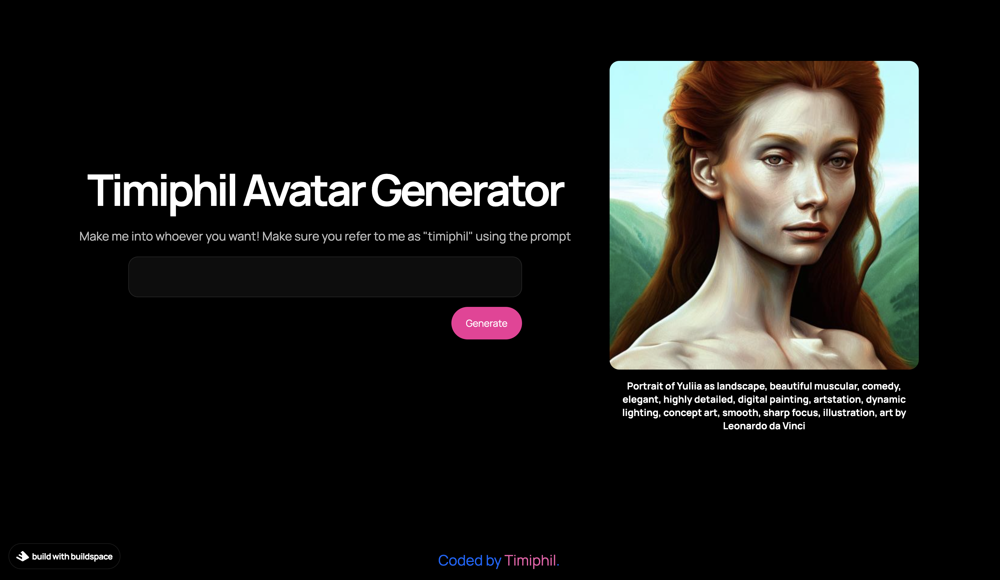

# Timiphil Avatar Generator

This is an AI Avarter generator. It's an incredible web app that is built with Stable Diffusion for ML image diffusion, Dreambooth for training implementation, Hugging Face for hosting pre-trained models, Google Colab for evaluating the model and importing an image dataset, Jupyter notebooks for code execution and visualization of the output, and Next.js a React framework which is the building blocks to create web application.

  
  

## About this Project

This project welcome me to the world of AI generated art through a sick open source software called _“Stable Diffusion”_ like __Dall-e__ or __MidJourney__. __Stable Diffusion__ is game changer - it's techniques helps to fine-tune and combine them with other tech to create extremely accurate depictions of any character on the internet. 
***

1.  Learning on how prompt works where the AI go through process training data, deep learning, latent space, generation, and to output. Using prompt from text to actual image.

2. I trained __Stable Diffusion__ using a technique called Brimbles to teach Stable Diffusion what I look like using identifiers.

3. Building a web application that generate images using Next.js that is deploy through Railway.

***

## How To Use It

Type any prompt in the input of any character of whoever you want to be and the timiphil will generate it for you. You can also use it to generate logo for your website. There is no limitations, you can do anything that you imagine. Examples of prompt are:

> “Portrait of timiphil(person) as avatar(character), muscular, fantasy, intricate, elegant, highly detailed, digital painting, artstation, concept art, smooth, sharp focus, illustration, art by Michael Armitage(artist 1) and Andre Hemer (artist 2) and Julia Watchel(artist 3)”.

> Portrait of Yuliia as landscape, beautiful muscular, comedy, elegant, highly detailed, digital painting, artstation, dynamic lighting, concept art, smooth, sharp focus, illustration, art by Leonardo da Vinci.

***

## Links

[Link to Portfolio Website](https://timiphil.github.io/MyPortfolio/)

[Link to Timiphil Avatar Generator](https://ai-avatar-starter-production-2265.up.railway.app/)

***

## Learning More

I intend to learn more on prompt engineering, how AI works and improve this application for good user experience.

To learn more about Next.js, take a look at the following resources:

- [Next.js Documentation](https://nextjs.org/docs) - learn about Next.js features and API.

***
## Labels

